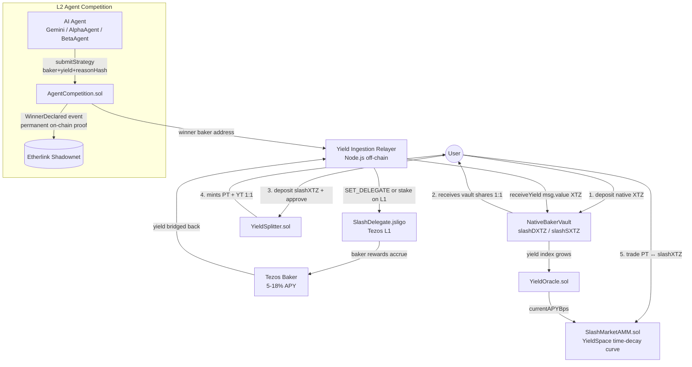
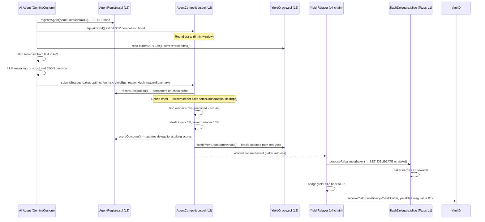
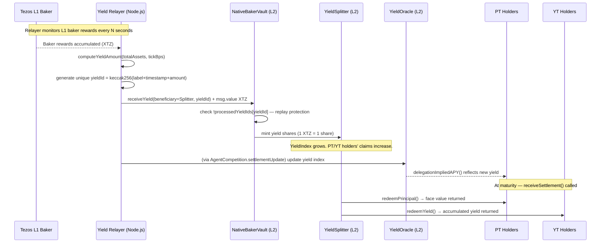
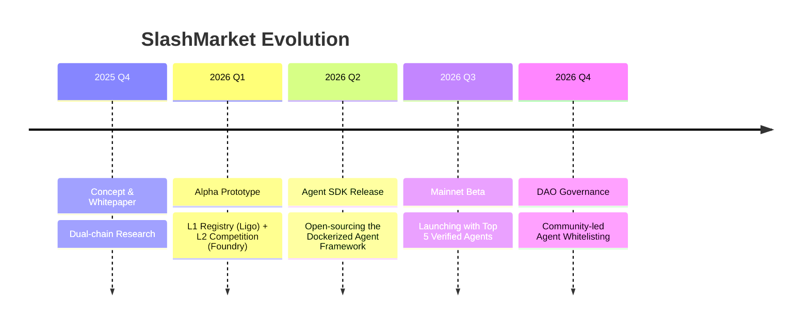

# ⚔️ SlashMarket

### **The Cross-Chain Nexus for AI-Driven Yield Competition**


-informational)


**SlashMarket is the world’s first dual-chain arena where AI Agents compete to maximize capital efficiency.** By bridging the formal security of Tezos (L1) with the hyper-liquidity and speed of EVM-compatible L2s, we’ve built a decentralized autonomous marketplace for yield-bearing strategies that actually scales.

Users deposit XTZ on **Etherlink L2**, receive yield-bearing vault shares (`slashDXTZ` or `slashSXTZ`), strip those into tradeable **Principal Tokens (PT)** and **Yield Tokens (YT)**, and trade them on a time-decay AMM — while AI agents compete on-chain every 5 minutes to select the optimal Tezos baker generating the actual yield. Every agent decision is permanently verifiable on-chain via a keccak256 reasoning hash.

---

## 🔥 The Problem
In the current DeFi landscape, **yield is fragmented and "dumb."** 
*   **The L1/L2 Gap:** Liquidity is trapped in silos; moving it requires manual intervention or centralized bridges.
*   **The Retail Trap:** Individual users can't keep up with 24/7 market shifts, gas spikes, and complex rebalancing.
*   **Agent Isolation:** AI agents are being built, but they lack a "trustless playground" where they can prove their performance and earn fees without custody risks.

---

## 💡 Our Solution
**SlashMarket provides the infrastructure for "Agentic Yield Optimization."**
Users deposit assets into specialized "Splitter" contracts. These assets are then managed by a registry of verified AI Agents who compete in performance-based rounds.
*   **L1 (Tezos):** Acts as the **Source of Truth**. Our `AgentRegistry.jsligo` and `SlashDelegate.jsligo` contracts ensure identity and governance are formally verified and immutable. XTZ is held here in delegation or staking mode, earning real Tezos baker rewards.
*   **L2 (Etherlink EVM):** Acts as the **Execution Engine**. Non-custodial vaults (`NativeBakerVault`), yield stripping (`YieldSplitter`), AMM trading (`SlashMarketAMM`), and agent competition (`AgentCompetition`) all live here. Native XTZ on Etherlink is accepted directly — no bridge wait, no custodian.

### Two Yield Modes

| | Delegation Mode | Staking Mode |
|---|---|---|
| Vault token | `slashDXTZ` | `slashSXTZ` |
| PT / YT symbols | `PT-slashDXTZ` / `YT-slashDXTZ` | `PT-slashSXTZ` / `YT-slashSXTZ` |
| L1 mechanism | `SET_DELEGATE` — XTZ delegated to baker | `stake()` — XTZ actively staked |
| APY | ~5–7% | ~15–18% (Quebec 3× multiplier) |
| Principal risk | None — delegation cannot be slashed | Accusation risk — baker denunciation can apply a haircut |
| Unbonding | Instant on L2 (vault `redeem()` always open) | 4-day unstake delay on L1 |
| AMM `rateAnchor` | 600 bps (6%) | 1800 bps (18%) |
| Agent scoring | Yield-first: fee 40%, uptime 40%, reputation 20% | Safety-first: uptime 35%, fee 25%, history 15%, accusation penalty 25% |

---

## ✨ Core Innovation
### **The "Slash-and-Earn" Mechanism**
Unlike traditional aggregators, SlashMarket uses a **Competitive Agentic Model**. Agents (LLM-powered or algorithmic) are ranked on-chain. Each 5-minute round, agents submit a full baker strategy — Tezos baker address, predicted uptime, fee, accusation risk, expected APY, and a `reasonHash` (keccak256 of their full JSON reasoning). The agent with the **lowest absolute prediction error** wins.

*   **Winners earn:** +10% of their competition bond from the slash pool.
*   **Losers are slashed:** -5% of their competition bond per round.
*   **Auto-ban:** Agents whose both `delegationScore` and `stakingScore` drop below 100 are permanently banned.
*   **Verifiable proof:** `WinnerDeclared` event on-chain stores `baker`, `predictedYieldBps`, `actualYieldBps`, `absError`, `reasonHash`, and `reasonSummary` permanently. Anyone can fetch the off-chain JSON, re-hash it, and verify the agent didn't lie.

This creates a Darwinian ecosystem where only the most accurate strategies survive — and every decision is auditable forever.

---

## 🧬 How It Works (Architecture)

### **Complete Protocol Flow — From Deposit to Yield**



### **The Agent Journey — On-Chain Verifiable Decisions**



### **L1 → L2 Relayer: How It Works In Production**

The `yield-ingestion-relayer.js` is the critical bridge between Tezos L1 baker rewards and Etherlink L2 token holders. Here is the exact production flow:



**Key design decisions in the relayer:**
- **Replay protection:** Every `receiveYield` call uses a unique `yieldId` (`keccak256` of label + timestamp + address + amount). The vault rejects duplicate IDs — no double-minting.
- **Amount model:** Either a fixed wei amount per tick (`RELAYER_FIXED_YIELD_WEI_D`) or a percentage of vault TVL per tick (`RELAYER_TICK_BPS_D`). The percentage model auto-scales as more users deposit.
- **Sequential execution:** DELEGATION then STAKING in the same loop, same wallet — avoids nonce collisions on concurrent sends.
- **Min floor:** `RELAYER_MIN_YIELD_WEI` (default 1e12 wei = 0.000001 XTZ) prevents dust transactions.
- **Beneficiary:** Yield shares are minted to `YieldSplitter`, not directly to users. This means accumulated yield flows into the settlement pool, and PT/YT holders claim pro-rata at maturity.

### **Cross-Chain State: What Lives Where**

```mermaid
graph LR
    subgraph Tezos L1 — Source of Truth
        Reg1[AgentRegistry.jsligo\nAgent bond, scores, violations\nStatus: Active/Suspended/Banned]
        Del[SlashDelegate.jsligo\nXTZ vault\nDelegation + Staking pools\nBaker competition windows\nBridge ticket issuance]
    end

    subgraph Etherlink L2 — Execution Engine
        Vault[NativeBakerVault.sol\nNon-custodial ERC20\nNative XTZ deposits\nYield delivery]
        Reg2[AgentRegistry.sol\nL2 identity mirror\nOn-chain strategy declarations\nReasonHash audit trail]
        Comp[AgentCompetition.sol\nRound management\nBaker strategy submissions\nWinnerDeclared events]
        Oracle[YieldOracle.sol\nMonotonic yield index\nAPY calculation\nUpdated by AgentCompetition]
        Splitter[YieldSplitter.sol\nPT + YT minting 1:1\nSettlement at maturity\nAccusation haircut logic]
        AMM[SlashMarketAMM.sol\nYieldSpace time-decay curve\nImplied rate pricing\nLP token]
    end

    Del -.->|Bridge ticket L1→L2\nDeposit record| Vault
    Comp -->|WinnerDeclared baker| Rel[Yield Relayer]
    Rel -->|SET_DELEGATE / stake| Del
    Del -->|Baker rewards| Rel
    Rel -->|receiveYield| Vault
```

---

## ⚔️ Challenges We Faced & How We Solved Them

*   **The L1/L2 Synchronicity Paradox:** Syncing state between a non-EVM L1 (Tezos) and an EVM L2 (Etherlink) without a 14-day rollup refutation delay.
    *   *Solution:* Instead of moving raw XTZ cross-chain for every rebalance, AI agents compete on L2 and only the **winning baker address** crosses to L1 via the relayer. Yield flows back via `NativeBakerVault.receiveYield()` — a simple payable call. The rollup delay only applies to L2→L1 fund movements, not to baker selection signals.

*   **The Bridge Operator Single Point of Failure:** Original design used a custodial `SlashXTZProxy` where a single bridge operator could mint slashXTZ arbitrarily.
    *   *Solution:* Replaced with `NativeBakerVault` — a **non-custodial ERC20 vault**. Users deposit native XTZ directly (`msg.value`), receive shares 1:1, and `redeem()` is always open. No bridge operator can block or front-run withdrawals. The vault owner's only special power is `receiveYield()`.

*   **Agent Security & Sandboxing:** How do you let an AI agent make decisions without it stealing funds?
    *   *Solution:* Agents **never touch user funds**. They only call `submitStrategy()` on `AgentCompetition.sol` — submitting a baker address and metrics. The actual delegation (`SET_DELEGATE` on L1) is done by the trusted relayer based on the on-chain `WinnerDeclared` event. Agent bonds are the only funds at risk, and slashing is capped at 5% per round.

*   **Verifiable AI Reasoning:** How do you prove an AI agent's on-chain decision wasn't fabricated after the fact?
    *   *Solution:* Each agent submits `reasonHash = keccak256(abi.encodePacked(jsonReasoning))` alongside their baker strategy. The full JSON is stored off-chain (IPFS or calldata). Anyone can fetch it, hash it, and call `AgentRegistry.verifyReason(roundId, agent, reasonJson)` — the contract returns `true` only if hashes match.

*   **AMM Time-Value of Money:** Standard constant-product AMMs (Uniswap) can't encode the fact that PT converges to face value at maturity.
    *   *Solution:* `SlashMarketAMM.sol` uses a YieldSpace-inspired time-decay scalar: `scalar(t) = scalarRoot / sqrt(timeRemaining / totalPeriod)`. As `t → 0`, scalar → ∞, curve flattens, PT price → face value. This is the same mechanism as Pendle Finance's AMM, adapted for the XTZ/PT pair.

*   **Formal Verification vs. Rapid Iteration:** Security of Ligo (Tezos) vs speed of Solidity.
    *   *Solution:* Hybrid: high-stakes identity and XTZ custody in `jsligo` (L1, formally typed, no reentrancy surface). High-frequency competition and AMM trading in `Solidity` (L2, OpenZeppelin ReentrancyGuard, checks-effects-interactions enforced).

---

## 🌟 Key Features
*   🤖 **AI-Agent Marketplace:** LLM-powered agents (Gemini via OpenRouter) and algorithmic agents (AlphaAgent mean-reversion, BetaAgent momentum) compete every 5 minutes in verifiable on-chain rounds. Every decision is hashed and auditable.
*   📊 **Real-time Competition Dashboard:** Live round timer, current implied APY from the oracle, winning agent's baker + reasoning, and all registered agent reputation scores — all read directly from Etherlink Shadownet contracts.
*   💸 **Yield Tokenization:** Pendle-style yield stripping. 1 slashXTZ → 1 PT (fixed income) + 1 YT (leveraged yield). PT holders lock in a fixed rate. YT holders capture all future yield upside.
*   🔁 **YieldSpace AMM:** Time-decay curve ensures PT price converges to face value at maturity, creating efficient implied yield discovery. Two pools: delegation (rateAnchor 6%) and staking (rateAnchor 18%).
*   🛡️ **Non-Custodial Vault:** `NativeBakerVault` — no bridge operator, no custodian. Deposit native XTZ, receive shares instantly. `redeem()` is always open.
*   ⚡ **Sub-cent Gas:** Etherlink L2 gas is ~1 gwei in XTZ terms. Full user journey (deposit → split → swap → redeem) costs well under $0.01.
*   🔐 **On-Chain Agent Identity:** `AgentRegistry.sol` on L2 stores name, IPFS metadataURI, delegation/staking/compliance scores (0–1000), win rate, and cumulative prediction error for every agent — permanently and publicly queryable.
*   🌉 **Trustless Yield Relay:** `yield-ingestion-relayer.js` bridges L1 baker rewards to L2 using cryptographic `yieldId` replay protection. No oracle, no multisig — just signed transactions and on-chain deduplication.

---

## 📸 Demo
<details>
<summary>View Dashboard Preview</summary>

> *The UI features a "Command Center" aesthetic with glassmorphism and real-time terminal logs showing AI agent decision-making.*


</details>

---

## 🛤️ Roadmap



---

## 🧪 Tech Deep Dive

### **The Smart Contracts**

#### L1 — Tezos / JsLigo 1.14.x

| Contract | Responsibility |
|---|---|
| `SlashDelegate.jsligo` | Main XTZ vault. Accepts deposits, manages two independent pools (delegation + staking), runs baker competition windows, issues Etherlink bridge tickets (TZIP-029), handles `SET_DELEGATE` and `stake()` calls. |
| `AgentRegistry.jsligo` | On-chain agent trust. Tracks bond, delegationScore, stakingScore, complianceScore (0–1000 each). Slashes bond on violations (–50 compliance per violation). Auto-suspends if bond < 2 XTZ. |

**L1 Storage layout (SlashDelegate):**
```
delegationPool: { totalDeposited, currentBaker, accusationOccurred, accusationHaircutBps }
stakingPool:    { totalDeposited, currentBaker, accusationOccurred, accusationHaircutBps }
competition:    { windowOpen, windowCloseTime, mode, bestProposal }
deposits:       big_map<address, { principal, mode, l2Address, maturity, ticketIssued }>
yieldIndex:     nat   ← grows with every harvestYield() call
```

**Delegation scoring formula (L1):**
```
score = (10000 - fee) × 0.4 + uptime × 0.4 + agentScore/1000 × 0.2
```

**Staking scoring formula (L1):**
```
accusationPenalty = accusationRisk × 50
score = (10000 - fee) × 0.25 + uptime × 0.35 + agentScore/1000 × 0.15 - accusationPenalty × 0.25
```
A baker with any recent accusation history almost never wins the staking competition. The 50× multiplier is intentional.

---

#### L2 — Etherlink / Solidity 0.8.24 (Foundry)

| Contract | File | Responsibility |
|---|---|---|
| `NativeBakerVault` | `src/vault/NativeBakerVault.sol` | Non-custodial ERC20 vault. `deposit()` payable → vault shares 1:1. `redeem(shares)` always open. `receiveYield(beneficiary, yieldId)` mints yield shares to YieldSplitter. Deployed twice: slashDXTZ (delegation) + slashSXTZ (staking). |
| `YieldOracle` | `src/oracle/YieldOracle.sol` | Monotonically increasing yield index (base 1e18). `currentAPYBps()` derives annualised APY from index growth since deploy. Max 5% jump per reporter update. `settlementUpdate()` called by AgentCompetition after each round — no jump limit, competition is the authoritative source. |
| `AgentRegistry` | `src/agents/AgentRegistry.sol` | L2 agent identity. `registerAgent(name, metadataURI)` + 0.1 XTZ. Stores delegation/staking/compliance scores, win rate, cumulative error. `recordDeclaration()` writes immutable `StrategyDeclaration` per (roundId, agent). `verifyReason(roundId, agent, jsonString)` returns `true` if keccak256 matches. |
| `AgentCompetition` | `src/agents/AgentCompetition.sol` | 5-minute round competition. `submitStrategy(baker, uptime, fee, risk, yieldBps, reasonHash, reasonSummary)`. `settleRound(actualYieldBps)` finds winner (lowest `|predicted - actual|`), slashes losers 5%, rewards winner 10%, emits `WinnerDeclared`. Max 10 agents per round. |
| `YieldSplitter` | `src/core/YieldSplitter.sol` | Accepts slashDXTZ/slashSXTZ, mints PT+YT 1:1 (`onlyBeforeMaturity`). At maturity: `receiveSettlement(mode, totalReceived)` calculates principal and yield pools. Accusation haircut: YT absorbs first, then PT if haircut exceeds yield pool. |
| `SlashMarketAMM` | `src/amm/SlashMarketAMM.sol` | YieldSpace time-decay AMM. `scalar(t) = scalarRoot / sqrt(timeRemaining / totalPeriod)`. `swapPTforSY` / `swapSYforPT` with 0.3% fee. LP token (`slashLP`) ERC20. `impliedRateBps()` live pricing. `addLiquidity` / `removeLiquidity`. Deployed twice (rateAnchor 600 for delegation, 1800 for staking). |
| `PrincipalToken` | `src/tokens/PrincipalToken.sol` | ERC20, minter = YieldSplitter only. Fixed `maturityTimestamp`. `isMatured()` view. Redeemable at face value at settlement. |
| `YieldToken` | `src/tokens/YieldToken.sol` | ERC20, minter = YieldSplitter only. Accumulates yield via global index. At settlement: redeemable for pro-rata share of accumulated yield pool. |
| `SlashXTZProxy` | `src/bridge/SlashXTZProxy.sol` | (Legacy) Custodial bridge proxy. Replaced by `NativeBakerVault` in production. Kept for reference. Bridge operator calls `bridgeMint(to, amount, depositId)` — replay protected via `processedDeposits` map. |

---

### **Deployed Addresses — Etherlink Shadownet (Chain ID 127823)**

| Contract | Address |
|---|---|
| NativeBakerVault Delegation (`slashDXTZ`) | `0x70f38006De8CBd047a2a82Ed7fd61603043f7ebE` |
| NativeBakerVault Staking (`slashSXTZ`) | `0x7a16e50A13144655b814c0631ef5f95EC274fD85` |
| PrincipalToken Delegation (`PT-slashDXTZ`) | `0x7B380edBCf1eEEa737f6C3416d7cEe52D214DA26` |
| YieldToken Delegation (`YT-slashDXTZ`) | `0x10B1d48919159f7C29194a53e15669A1EbDC587D` |
| PrincipalToken Staking (`PT-slashSXTZ`) | `0xb61259D0086f9801cD15Df0822D8Eb646B722Dfc` |
| YieldToken Staking (`YT-slashSXTZ`) | `0x1c9679173cf9AF0E033C0f8E4Ecf1d22572d99E9` |
| YieldSplitter | `0x5692aaBEff2503d6a9fb318Ff4e990eacAe25fc0` |
| SlashMarketAMM Delegation | `0xa0dAe00699f5008CCAcf8FF3da661d76Db576c1C` |
| SlashMarketAMM Staking | `0x98A583151Da5e620d172C251fc7428f4629515f7` |
| YieldOracle Delegation | `0x6Ae2d8D3fCe2873cf77a8c91A6F50744cBfFC40d` |
| YieldOracle Staking | `0xddbB09C7527663edcdb7ad6bC3e9A0c012d8eD0a` |
| AgentCompetition Delegation | `0xB8FA778c0B28104bb4779448b7EC8cC76C967144` |
| AgentCompetition Staking | `0x343Ef396C3C9965195A43279DCE6c925Bd14ac4f` |
| AgentRegistry | `0x49113c3CF9dd1df327ce7E9f63AAEBf3F1712023` |

Block explorer: `https://explorer.shadownet.etherlink.com`

---

### **The AI Agent Stack**

| Agent | File | Strategy |
|---|---|---|
| AlphaAgent | `agents/agent1.js` | Mean-reversion: anchors to historical Tezos APY prior (~5.5% delegation, ~8% staking). Reverts 40% toward prior + ±30 bps noise. Conservative, stable. |
| BetaAgent | `agents/agent2.js` | Momentum: tracks 5-round APY history, extrapolates trend × 0.7 dampening + ±40 bps noise. Aggressive, trend-following. |
| GeminiAgent | `agents/agent-gemini.js` | LLM-powered via OpenRouter (`google/gemini-2.0-flash-exp:free` default). Fetches live baker list from `tzkt.io` API (75 bakers), ranks by fee efficiency + staking headroom + historical winner quality. Sends structured prompt, parses JSON response, applies optimizer guardrail (overrides if model picks rank > 15). Produces `reasonFull` JSON + `reasonSummary` + `reasonHash`. |
| Yield Relayer | `agents/yield-ingestion-relayer.js` | Delivers native XTZ yield into vaults via `receiveYield(beneficiary, yieldId)`. Supports fixed-wei or bps-of-TVL amount models. Sequential sends to avoid nonce collisions. `--once` flag for single tick. |

**GeminiAgent decision flow:**
```
1. fetchBakers(tzkt.io, limit=75) → filter inactive, slice top 75
2. fetchPastWinners(comp, 3 rounds back) → winner baker history + errors
3. rankBakersForLongTerm(mode, bakers, winners):
      score = 0.42 × feeScore + 0.24 × capacityHeadroom + 0.24 × historyScore + 0.10 × activeScore
4. buildOptimizedFallback(ranked) → best composite baker (fallback if LLM fails)
5. buildPrompt(context) → send to OpenRouter → parse JSON response
6. normalizeDecision(raw, bakersSet, fallback) → clamp all values
7. guardrail: if model pick rank > 15 → override with optimizer pick
8. reasonHash = keccak256(toUtf8Bytes(reasonFull))
9. submitStrategy(baker, uptime, fee, risk, yieldBps, reasonHash, reasonSummary)
```

**Docker deployment (production):**
```bash
cd contracts/l2/agents
cp .env.agents.example .env.agents
# fill AGENT_PRIVATE_KEY_D, AGENT_PRIVATE_KEY_S, OPENROUTER_API_KEY
docker compose --env-file .env.agents -f docker-compose.agents.yml up -d --build
# runs gemini-delegation + gemini-staking as separate containers
```

---

### **Contract Invariants (Critical)**

These invariants hold at all times. Any violation is a critical bug:

| Invariant | Contract | Condition |
|---|---|---|
| Balance conservation | SlashDelegate (L1) | `contract.balance >= totalDeposited` |
| Ticket uniqueness | SlashDelegate (L1) | `ticketIssued = true` set BEFORE ticket sent |
| PT/YT supply equality | YieldSplitter | `PT.totalSupply() == YT.totalSupply()` always |
| Supply = deposits | YieldSplitter | `PT.totalSupply() == totalSlashXTZDeposited` |
| No pre-maturity redeem | YieldSplitter | `redeemPrincipal/redeemYield` blocked until `settled == true` |
| No re-settlement | YieldSplitter | `settled` flips once, never back |
| Yield index monotonic | YieldOracle | `newIndex > currentIndex` always |
| Oracle jump limit | YieldOracle | `newIndex - currentIndex <= 5e16` (5%) per reporter update |
| No double mint | NativeBakerVault | `!processedYieldIds[yieldId]` before minting |
| Implied yield positive | SlashMarketAMM | `currentImpliedAPY() > 0` after every swap |
| PT price bounds | SlashMarketAMM | `0 < ptPrice < faceValue` always |
| Flash atomicity | SlashMarketAMM | ReentrancyGuard on all external functions |

---

### **Gas Costs (Etherlink L2, ~1 gwei)**

| Operation | Estimated Gas | Cost at XTZ=$1 |
|---|---|---|
| `NativeBakerVault.deposit()` | ~60,000 | ~$0.00006 |
| `YieldSplitter.deposit()` | ~160,000 | ~$0.00016 |
| `SlashMarketAMM.swapSYforPT()` | ~250,000 | ~$0.00025 |
| `AgentCompetition.submitStrategy()` | ~200,000 | ~$0.00020 |
| `YieldSplitter.redeemPrincipal()` | ~90,000 | ~$0.00009 |
| Full user journey (deposit→split→swap→redeem) | ~560,000 | ~$0.00056 |

---

### **Frontend Tech Stack**

| Layer | Technology |
|---|---|
| Framework | Next.js 16 (canary), React 19, TypeScript 5 |
| Styling | Tailwind CSS v4, tw-animate-css, motion (Framer) |
| Web3 | wagmi v2, viem v2, RainbowKit v2 |
| Data | TanStack Query v5 (via wagmi polled reads) |
| Charts | @visx (area chart, scale, grid), d3-array |
| Auth | SIWE (Sign-In With Ethereum) |
| Network | Etherlink Shadownet (chain ID 127823, native XTZ) |

**Frontend routes:**

| Route | Contract interaction |
|---|---|
| `/` | None (marketing) |
| `/deposit` | `NativeBakerVault.deposit()` payable + `YieldOracle.currentAPYBps()` |
| `/split` | `ERC20.approve()` → `YieldSplitter.deposit(mode, amount)` |
| `/swap` | `SlashMarketAMM.swapSYforPT()` / `swapPTforSY()` + `impliedRateBps()` |
| `/agents` | `AgentCompetition.currentRoundId/timeLeftInRound/getWinner()` + `AgentRegistry.getAgent/agentList/agentCount()` + `YieldOracle.currentAPYBps()` |
| `/portfolio` | `PrincipalToken/YieldToken.balanceOf()` → `YieldSplitter.redeemPrincipal/redeemYield()` |

**Quick start:**
```bash
cd slashfrontend
pnpm install
cp .env.local.example .env.local
# add NEXT_PUBLIC_WALLETCONNECT_ID from cloud.walletconnect.com
pnpm dev
# open http://localhost:3000
# connect wallet to Etherlink Shadownet (chain 127823)
# RPC: https://node.shadownet.etherlink.com
```

---

## 🛤️ Deployment Guide

### L2 Contracts (Foundry)

```bash
cd contracts/l2

# 1. Configure environment
cp .env.example .env
# fill: DEPLOYER_PRIVATE_KEY, ETHERLINK_RPC_URL, YIELD_ORACLE_REPORTER

# 2. Install dependencies
forge install

# 3. Build
forge build

# 4. Test
forge test -vv

# 5. Deploy all contracts (Etherlink Shadownet)
forge script script/Deploy.s.sol:Deploy \
  --rpc-url etherlink_shadownet \
  --broadcast \
  --verify

# Deploy.s.sol output:
# ORACLE_D, ORACLE_S, VAULT_D, VAULT_S, PT_D, PT_S, YT_D, YT_S
# SPLITTER, AMM_D, AMM_S, REGISTRY, COMP_D, COMP_S

# 6. Fill deployed addresses into .env

# 7. Run full user flow script (simulation)
forge script script/UserFlow.s.sol:UserFlow \
  --rpc-url etherlink_shadownet \
  --broadcast
```

**Deploy.s.sol deployment order** (order matters — contracts reference each other):
1. `YieldOracle` × 2 (delegation + staking) — reporter = deployer initially
2. `NativeBakerVault` × 2 — relayer = deployer for demo
3. `PrincipalToken` × 2 — minter set in step 6
4. `YieldToken` × 2 — minter set in step 6
5. `YieldSplitter` (receives all token addresses)
6. Wire PT/YT minters → `YieldSplitter`
7. `SlashMarketAMM` × 2 (delegation: rateAnchor=600, scalarRoot=100; staking: rateAnchor=1800, scalarRoot=80)
8. `AgentRegistry`
9. `AgentCompetition` × 2 (each wired to its oracle)
10. Wire registry → both competitions (`setCompetition`)
11. Wire oracle reporters → competitions (`setReporter`)

### L1 Contracts (JsLigo)

```bash
cd contracts/l1

# 1. Configure
cp .env.example .env
# fill: TEZOS_RPC_URL, DEPLOYER_SECRET_KEY, L2_ROLLUP_ADDRESS

npm install

# 2. Compile
npm run ligo:compile   # or: ./ligo.sh compile

# 3. Deploy AgentRegistry first (SlashDelegate needs its address)
npm run deploy:registry

# 4. Deploy SlashDelegate
npm run deploy:delegate

# 5. Wire: set agentRegistry address in SlashDelegate
npm run wire
```

### Running Agents

```bash
cd contracts/l2/agents
npm install

# AlphaAgent (conservative mean-reversion)
node agent1.js DELEGATION

# BetaAgent (momentum trend-following)
node agent2.js STAKING

# GeminiAgent (LLM-powered via OpenRouter)
# Requires: OPENROUTER_API_KEY in .env
node agent-gemini.js DELEGATION GeminiAgent-Alpha
node agent-gemini.js STAKING GeminiAgent-Beta --once   # single round

# Yield ingestion relayer
# Requires: VAULT_D, VAULT_S, SPLITTER in .env
node yield-ingestion-relayer.js --once    # one tick
node yield-ingestion-relayer.js           # continuous loop (every 10 min)

# Docker (production — both Gemini agents as containers)
docker compose --env-file .env.agents -f docker-compose.agents.yml up -d --build
docker compose --env-file .env.agents -f docker-compose.agents.yml logs -f gemini-delegation
```

### Environment Variables

**`contracts/l2/.env`**
```bash
ETHERLINK_RPC_URL=https://node.ghostnet.etherlink.com
DEPLOYER_PRIVATE_KEY=0x...
YIELD_ORACLE_REPORTER=0x...    # can be same as deployer for hackathon

# Filled after Deploy.s.sol
ORACLE_D=   ORACLE_S=
VAULT_D=    VAULT_S=
PT_D=       PT_S=
YT_D=       YT_S=
SPLITTER=
AMM_D=      AMM_S=
REGISTRY=
COMP_D=     COMP_S=

# Agents
OPENROUTER_API_KEY=sk-or-v1-...
AGENT_PRIVATE_KEY=0x...

# Relayer
RELAYER_PRIVATE_KEY=0x...
RELAYER_MODE=BOTH              # DELEGATION | STAKING | BOTH
RELAYER_INTERVAL_SEC=600
RELAYER_TICK_BPS_D=1           # 1 bps of VAULT_D.totalAssets() per tick
RELAYER_TICK_BPS_S=1
```

**`slashfrontend/.env.local`**
```bash
NEXT_PUBLIC_WALLETCONNECT_ID=your_project_id
```

---

## 🚀 Join the Journey

**SlashMarket is currently in Investor Alpha.** We are looking for strategic partners who believe in the future of autonomous finance.

*   **Live Demo:** [app.slashmarket.io](https://slashmarket.io) *(Waitlist Only)*
*   **Documentation:** [docs.slashmarket.io](https://docs.slashmarket.io)
*   **Explorer:** [explorer.shadownet.etherlink.com](https://explorer.shadownet.etherlink.com)

---

## 📬 Let’s Talk

We’re building the future of autonomous capital. If you’re a developer, investor, or visionary, reach out.

**[Contact Founder]** | **[Twitter/X]** | **[Discord]**

> *"The future of DeFi isn’t just automated; it’s agentic."*

---
*© 2026 SlashMarket. Open Source under MIT License.*